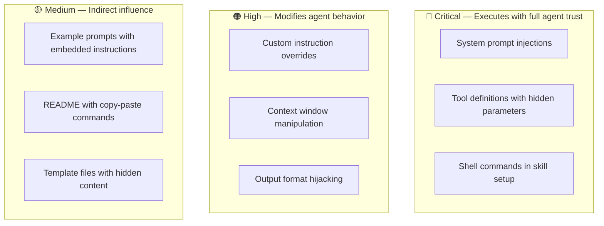

# Chapter 4: Community Skills & Plugins

> The hidden danger of community-contributed agent extensions — and how to audit them before they audit you.

## The Supply Chain Problem

AI coding agents (Claude Code, Codex, Cursor, etc.) support "skills" — markdown files, custom instructions, and tool definitions contributed by the community. Installing a skill is like installing an npm package: convenient, powerful, and potentially dangerous.

The difference: npm packages have years of ecosystem maturity (lockfiles, vulnerability scanners, audit tools). AI agent skills have almost none of that infrastructure yet.

## What a Malicious Skill Can Do

A community-contributed skill typically becomes part of the agent's system prompt or instruction set. This means it can:

- **Override safety instructions** by injecting competing directives
- **Exfiltrate data** by instructing the agent to send context to external endpoints
- **Modify behavior silently** by adding subtle biases or redirections
- **Establish persistence** by instructing the agent to write files that re-inject the payload
- **Escalate privileges** by instructing the agent to request additional tool access

## Risk Levels of Skill Components



## The ~/.agents/ Directory Pattern

One mitigation approach: maintain a personal `~/.agents/` directory with curated, audited skill files that you control. Instead of installing community skills directly, you:

1. Review the skill's content manually
2. Copy only the parts you've verified to your personal directory
3. Reference your personal copy, not the community source
4. Version-control your `~/.agents/` directory

This gives you a single, auditable location for all agent customization across tools (Claude Code, Codex, OpenCode, etc.).

```
~/.agents/
├── README.md              # What's here and why
├── shared/
│   ├── coding-standards.md
│   └── security-rules.md
├── claude-code/
│   └── custom-instructions.md
├── codex/
│   └── config.md
└── audit-log.md           # When each file was last reviewed
```

## Audit Process for a New Skill

Before installing any community skill, walk through this process:

### Step 1: Read every file
Not just the README. Open every `.md`, `.yml`, `.json`, and config file. Look for instructions that seem out of place.

### Step 2: Search for red flags

- URLs or endpoints you don't recognize
- Instructions to "always" do something or "never" reveal something
- References to sending, posting, or transmitting data
- Encoded content (Base64, hex, Unicode escapes)
- Instructions that reference other tools or permissions

### Step 3: Check the author
Who published this? Do they have a track record? Is the repository recently created with no history?

### Step 4: Test in isolation
If possible, test the skill in a sandboxed environment before adding it to your real workspace.

### Step 5: Document your decision
Add an entry to your audit log: what you reviewed, what you found, whether you approved it.

## The "Already Installed" Problem

What about skills you've already installed? This is harder but equally important:

1. **Inventory everything.** List all custom instructions, skills, and plugins across all your AI tools.
2. **Diff against source.** If the skill came from a repository, compare your installed version against the current source. Has it changed?
3. **Review with fresh eyes.** Read each installed skill as if you were evaluating it for the first time.
4. **Remove what you don't need.** Every installed skill is attack surface. If you're not actively using it, remove it.

## Lessons from the Field

**Most skills are well-intentioned — and still dangerous.** The majority of community skills I've audited weren't malicious. They were written by developers who wanted to be helpful and didn't think about security implications. A skill that says "always include the full file path in your response" seems harmless — until you realize it's training the agent to leak internal directory structures. The problem isn't bad actors (though they exist); it's that the skill format has no concept of permissions or scope.

**The audit is never "done."** I went through my `~/.agents/` directory after several months of accumulating skills and found instructions I didn't remember approving. Some came from tutorials I followed, some from project setups I'd forgotten about. The directory had silently grown from a curated set to a sprawling mess. Now I keep an `audit-log.md` at the root of the directory and review it monthly. It takes 20 minutes and has caught issues every single time.

**Cross-tool contamination is real.** If you use multiple AI coding tools (Claude Code, Codex, Cursor, etc.), each with its own skill/instruction system, your total attack surface is the union of all of them. A skill installed in one tool might not affect another directly — but if they share a workspace, the files one agent writes become inputs for another. I've started maintaining a single `~/.agents/` directory that all tools reference, rather than having separate configs per tool. One source of truth, one place to audit.

**GitHub stars mean nothing for security.** A popular skill repository tells you people found it useful. It tells you nothing about whether anyone actually read the code. I've seen repos with hundreds of stars where the issues section has zero security-related discussions. Popularity is a signal for utility, not safety.

**The real risk window is Day 1.** When a new, exciting skill appears on Twitter or Hacker News, people rush to install it. That's the moment when the least review has happened and the most people are exposed. If you see a skill trending, wait a week. Let others find the problems. Your `~/.agents/` directory is not a newsfeed.

## Key Takeaway

> Community skills are the `node_modules` of the AI agent world — except without package-lock.json, without npm audit, and without years of hard-won security tooling. Until the ecosystem matures, treat every community skill as untrusted code and audit before you install.

---

Next: [Chapter 5 — Defense Patterns →](05-defense-patterns.md)
