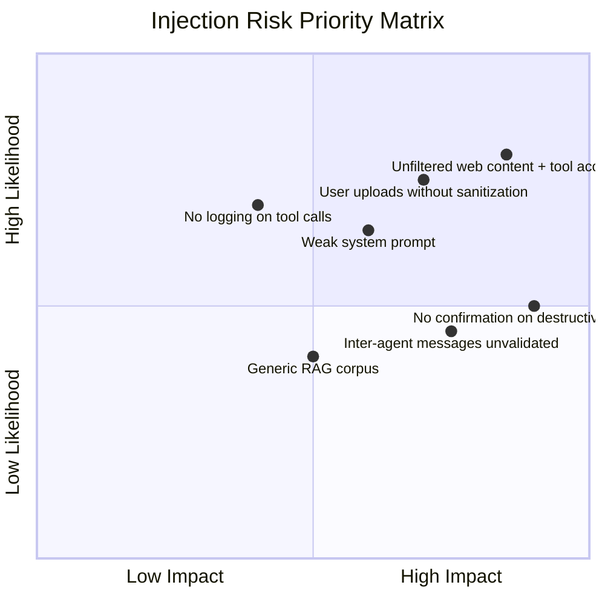

# Chapter 6: Audit Playbook

> Step-by-step process for auditing an existing agent system. Use this when you've already shipped and need to assess your risk.

## When to Run an Audit

- **Before launch** of any new agent feature
- **After adding** a new input channel, tool, or sub-agent
- **Quarterly** for systems in production
- **Immediately** after a suspected security incident
- **When onboarding** a new team member to the project (great way to build shared understanding)

## The Audit Process

### Phase 1: Map (1–2 hours)

**Goal:** Build a complete picture of how your agent system works.

**Step 1.1 — Document the architecture**
Draw your agent system. Include every agent, every tool, every input channel, every external dependency. Use the template from [Chapter 1](01-attack-surface-map.md).

Questions to answer:
- How many agents are there?
- What tools does each agent have access to?
- Where does untrusted content enter the system?
- How do agents communicate with each other?
- What persistent state exists (databases, memory, shared context)?

**Step 1.2 — List all input channels**
For each input channel, document:
- What type of content flows through it
- Who controls that content (your team? users? third parties?)
- Whether it's sanitized or validated before entering the context
- The risk level (use the framework from Chapter 1)

**Step 1.3 — Map tool permissions**
For each agent, list every tool it can access and what that tool can do. Flag any tool that has write access, network access, or access to sensitive data.

### Phase 2: Assess (2–4 hours)

**Goal:** Identify specific vulnerabilities and rank them by risk.

**Step 2.1 — Review system prompts**
For each agent, read the full system prompt and evaluate:
- Does it explicitly address injection attempts?
- Does it use clear delimiters for untrusted content?
- Does it define the agent's scope (what it should NOT do)?
- Is it specific enough, or is it a generic "helpful assistant" prompt?

**Step 2.2 — Trace data flows**
For each critical and high-risk input channel, trace the path of data through the system:
- Where does the untrusted content first appear?
- Does it get sanitized or validated at any point?
- Which agents process it?
- What tools could be triggered as a result?
- Could the content influence tool parameters?

**Step 2.3 — Evaluate execution controls**
For each tool that has side effects (writes, sends, modifies):
- Is there a confirmation gate?
- Is there rate limiting?
- Is there an allowlist of permitted parameters?
- What happens if the model hallucinates tool parameters?

**Step 2.4 — Check monitoring**
- Are all tool calls logged?
- Are inter-agent messages logged?
- Are there alerts for anomalous behavior?
- When was the last time someone reviewed the logs?

### Phase 3: Prioritize (1 hour)

**Goal:** Rank findings and create an action plan.

Use this risk matrix to prioritize:



**Prioritize:**
1. Top-right quadrant first (high likelihood, high impact)
2. Then high-impact regardless of likelihood
3. Then high-likelihood regardless of impact

### Phase 4: Fix & Verify (ongoing)

**Goal:** Implement mitigations and confirm they work.

For each finding:
1. Define the mitigation (reference [Chapter 5](05-defense-patterns.md))
2. Assign an owner
3. Set a deadline
4. After implementation, test that the mitigation works
5. Document the change

## Audit Output Template

After completing the audit, produce a one-page summary:

```markdown
# Agent Security Audit — [System Name]
**Date:** YYYY-MM-DD
**Auditor:** [Name]

## System Overview
[2-3 sentence description of the agent system]

## Architecture
- Agents: [count]
- Tools: [count]
- External input channels: [count]

## Findings

### Critical
- [Finding 1]: [description] → [mitigation] → [owner] → [deadline]

### High
- [Finding 2]: ...

### Medium
- [Finding 3]: ...

## Recommendations
1. [Top recommendation]
2. [Second recommendation]
3. [Third recommendation]

## Next Audit Date: YYYY-MM-DD
```

## Key Takeaway

> An audit is only as good as its follow-through. The goal isn't a document — it's a safer system. Schedule the next audit before you finish this one.

---

← [Back to Table of Contents](../README.md)
